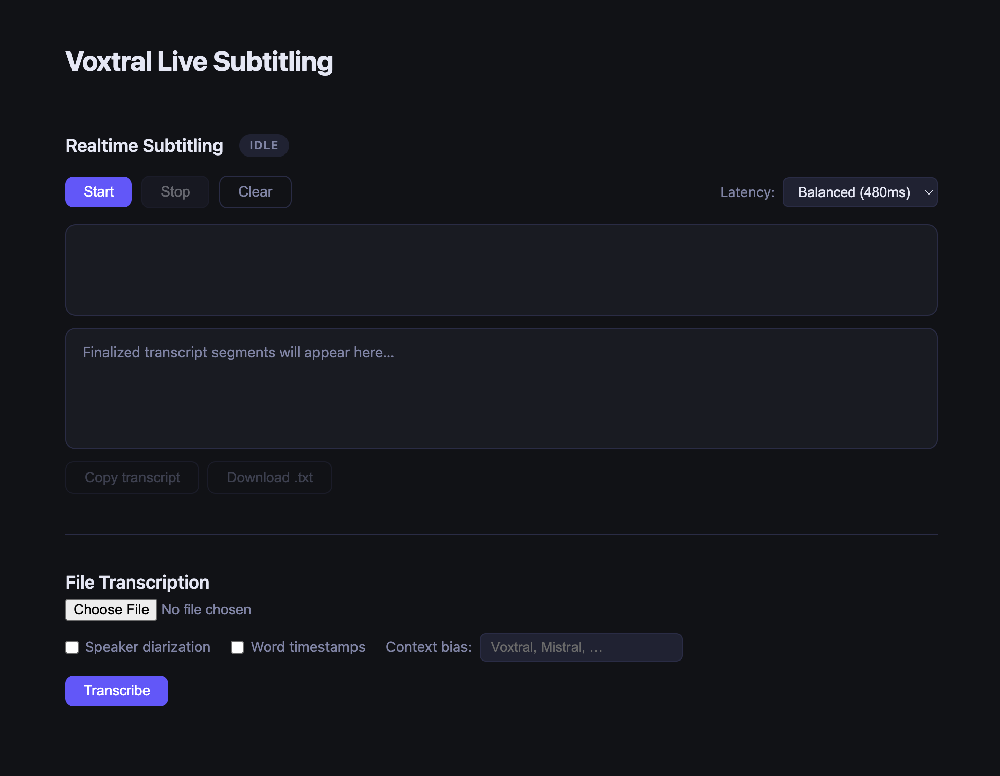

A few weeks ago I wrote about going through a Mistral course and, at the end, listed a few project ideas I kept coming back to. One of them was a closed captioning and subtitle tool: transcribe audio, clean it up, add timecodes, maybe translate.

Funny enough, the first real project in the course turned out to be almost exactly that: a subtitle and transcription app, built to the instructor's spec. I didn't come up with the idea myself this time, but it's close enough to what I'd been imagining that working through it felt like getting a sneak preview of my own list.

The result is a working app: live subtitles from your microphone, plus a separate panel for uploading an audio file and getting back a full transcript with timestamps, speaker labels, and per-word timing. I had Claude build it from the instructor's spec, and I want to walk through how the different pieces fit together, because some of them surprised me. The full code is on [GitHub](https://github.com/gjack/live-subtitling) if you want to follow along or poke at it yourself.

---

## Two Very Different Problems Wearing One UI

The app looks like a single page, but it's really two unrelated problems stapled together.

**Realtime subtitling** is a streaming problem. Audio comes in continuously from your microphone, and the model has to guess at words before it's heard the whole sentence, then revise itself as more audio arrives. It's a WebSocket, an open connection, partial results that get overwritten.

**Offline transcription** is a batch problem. You hand over a complete audio file and get back a complete answer: segments, speakers, word timings, all at once. No partial anything.

Both use the same underlying Voxtral model family, but the SDK shapes for talking to them are completely different, and so is the code. It's worth treating them separately, which is also how the spec was written.

---

## The Realtime Side: Two Tasks Talking Past Each Other

The realtime path is a FastAPI WebSocket endpoint that sits in the middle between your browser and Mistral's realtime transcription endpoint. The browser doesn't talk to Mistral directly; it talks to this server, and the server relays.

The first message the browser sends isn't audio, it's configuration:

```javascript
ws.onopen = async () => {
  ws.send(JSON.stringify({ latency: latencySel.value }));
  setStatus("connecting");
  await startCapture();
};
```

That `latency` value is the dual-delay trick from the spec: a dropdown with three presets, fast (240ms), balanced (480ms), and accurate (2.4s). It's a real tradeoff, not a cosmetic setting. Lower delay means subtitles appear almost instantly but the model has less audio context to work with, so it occasionally has to walk back what it said. Higher delay means the model waits longer before committing to a transcript, so what it produces is more accurate but feels laggier. The server maps that choice straight onto a Voxtral parameter:

```python
latency_map = {"fast": 240, "balanced": 480, "accurate": 2400}
delay_ms = latency_map.get(config.get("latency", "balanced"), 480)

connection = await client.audio.realtime.connect(
    model="voxtral-mini-transcribe-realtime-2602",
    audio_format=AudioFormat(encoding="pcm_s16le", sample_rate=16000),
    target_streaming_delay_ms=delay_ms,
)
```

Once that connection is open, the server is juggling two streams of data at once: audio coming *in* from the browser, and transcript events going *out* from Mistral. Those don't happen on the same schedule, so they're handled as two independent async tasks running side by side:

```python
receive_task = asyncio.ensure_future(receive_audio())
stream_task = asyncio.ensure_future(stream_events())

await asyncio.wait([receive_task, stream_task], return_when=asyncio.FIRST_COMPLETED)
```

`receive_audio` just shovels raw PCM bytes from the browser to Mistral as fast as they arrive. `stream_events` listens for whatever Mistral sends back and relays it the other way. The "first completed" wait matters because either side can end the conversation (the user clicking Stop ends `receive_audio`, while a connection error would end `stream_events`), and whichever one finishes first kicks off cleanup for both.

What Mistral sends back comes in two flavors, and the distinction is the whole UX of the subtitle experience. `TranscriptionStreamTextDelta` events are partial, provisional text: words the model thinks it heard but hasn't committed to yet. `TranscriptionStreamSegmentDelta` events are final, a complete chunk of speech with start and end timestamps that won't change. The frontend treats these completely differently:

```javascript
ws.onmessage = (e) => {
  const msg = JSON.parse(e.data);
  if (msg.type === "text_delta") {
    partialEl.textContent += msg.text;
  } else if (msg.type === "segment") {
    appendSegment(msg);
    partialEl.textContent = "";
  }
};
```

Partial text appends into a little preview area, which is the "tentative subtitle" effect, text that flickers and grows while you're still talking. The moment a segment arrives, that preview gets wiped and the finalized line drops into the permanent transcript panel with its timestamp. Watching this live is oddly satisfying: there's a visible texture to it, the rough draft dissolving into the clean version a beat later.

One detail I didn't expect: getting audio out of the browser in the right format takes more plumbing than I assumed. Mistral wants 16kHz mono PCM16, but `getUserMedia` gives you 32-bit floating point samples at whatever rate the hardware feels like. So there's a manual conversion step on every audio buffer:

```javascript
scriptNode.onaudioprocess = (e) => {
  const float32 = e.inputBuffer.getChannelData(0);
  const int16 = new Int16Array(float32.length);
  for (let i = 0; i < float32.length; i++) {
    let v = float32[i] * 32768;
    if (v > 32767) v = 32767;
    if (v < -32768) v = -32768;
    int16[i] = v;
  }
  ws.send(int16.buffer);
};
```

This callback fires every time the script node has accumulated another 4096-sample chunk from the microphone, which at 16kHz works out to about four times a second. The Web Audio API hands you that chunk as a `Float32Array`, where every sample is a number between -1.0 and 1.0 representing the waveform's amplitude at that instant, regardless of what the underlying hardware actually uses.

Voxtral wants something different: 16-bit signed integers (`pcm_s16le`), where the range is -32768 to 32767 instead of -1.0 to 1.0. The loop rescales each sample by multiplying by 32768, which maps -1.0 to -32768 and 1.0 to... 32768, one more than the format allows. That edge case is why the clamping lines exist; a sample sitting exactly at the top of the float range would otherwise overflow and wrap around to a loud click in the audio. Once clamped, assigning the value into an `Int16Array` slot truncates it to an integer, and `int16.buffer` gives you the raw bytes behind that array, ready to ship over the WebSocket as a binary frame.

It's a small loop, but it's a reminder that "send audio to an AI model" still involves the same low-level signal wrangling that's been part of audio programming forever. The model is new. The bit-shuffling to feed it is not.

---

## The Offline Side: Where the Real Gotchas Live

The file upload half of the app felt, on paper, like it should be the simpler one. No streaming, no async tasks, no WebSocket. Upload a file, call an API, get a structured response back.

In practice this is where most of the SDK's sharp edges were. None of them are exotic, they're just the kind of thing you only discover by trying it, which is exactly why having a spec written from someone else's hard-won experience was useful.

The first one: the method is `.complete()`, not `.create()`. Small, but the kind of thing that costs you ten minutes of staring at a stack trace.

The second: you can't hand the SDK a raw file or a `BytesIO`. It wants a `MistralFile` wrapper:

```python
result = client.audio.transcriptions.complete(
    model="voxtral-mini-latest",
    file=MistralFile(fileName=file.filename, content=contents),
    timestamp_granularities=["segment"],
)
```

(And since FastAPI *also* has something called `File`, the server imports it as `FastAPIFile` to keep the two from colliding, a small naming collision that would otherwise be very confusing to debug.)

The third gotcha is the one that shapes the whole endpoint's structure: `timestamp_granularities` only accepts one value at a time. You'd think `["segment", "word"]` would give you both segment-level and word-level timing in one response, but the SDK concatenates the list into a single string and the request comes back malformed. If you want both, and the spec calls for both as separate optional checkboxes, you make two separate calls:

```python
seg_kwargs = {**common_kwargs, "timestamp_granularities": ["segment"]}
if diarize:
    seg_kwargs["diarize"] = True
result = client.audio.transcriptions.complete(**seg_kwargs)

words = []
if word_timestamps:
    word_result = client.audio.transcriptions.complete(
        **{**common_kwargs, "timestamp_granularities": ["word"]}
    )
    for seg in (word_result.segments or []):
        words.append({"text": seg.text, "start": seg.start, "end": seg.end})
```

That second call has its own twist: when you ask for word-level granularity, the response doesn't give you segments with a nested list of words inside them. Each "segment" in that response *is* a single word. So the same `.segments` field means something structurally different depending on what you asked for: same shape, same field names, different meaning. It's the kind of inconsistency that's easy to miss until your word timestamps come out as one giant blob covering the entire file.

Diarization had its own small trap: turning on `diarize=True` without also requesting segment-level timestamps gets you a 422 error, because speaker labels are attached to segments and the API has nothing to attach them to otherwise. When it works, each segment comes back with a `speaker_id` like `"speaker_1"` or `"speaker_2"`, which the frontend turns into color-coded chips:

```javascript
function speakerClass(speakerId) {
  if (!(speakerId in speakerMap)) {
    const idx = Object.keys(speakerMap).length % SPEAKER_COLORS.length;
    speakerMap[speakerId] = SPEAKER_COLORS[idx];
  }
  return speakerMap[speakerId];
}
```

I tested diarization with a recording of my husband and me pretending to do an interview, taking turns asking and answering questions. The model correctly tagged each of us as a separate speaker for the whole recording. It worked exactly as expected, but it also left me with questions the test didn't answer. We were careful to take turns; what happens if we talk over each other? What if, instead of talking, we were singing? And if I did the whole recording myself but changed my voice for each "character," would the model still call that two speakers, or would it recognize both as me? Diarization clearly works for the clean, polite-conversation case. I have no idea where its edges are.

There's also context biasing, a comma-separated list of words you expect to show up (names, jargon, brand names) that nudges the model toward recognizing them correctly. It's offline-only; the realtime `.connect()` call doesn't accept it. I tried it on a recording of myself talking about using Mistral's voice transcription models. I speak English with a Hispanic accent, and without context biasing, "voice" kept coming back as "both", close enough phonetically that the model picked the wrong common word. Adding "voice" and "models" to the context bias list was enough to fix it.

---

## What It's Like to Use



The interface is intentionally plain: dark theme, two stacked panels, nothing that distracts from the transcript itself.

Open the app, hit Start, and start talking. Within a second or so, words start appearing in the subtitle area: tentative, sometimes slightly wrong, occasionally getting silently corrected as more context arrives. A beat later, a finalized line with a timestamp drops into the transcript below. Switch the latency preset to "accurate" and the tentative text basically stops appearing; you wait longer, but what lands is cleaner.

Drop a recording into the file upload section, tick "speaker diarization," and the transcript comes back with each turn of conversation labeled and color-coded. Tick "word timestamps" too and you get every single word laid out with its own timing, like a karaoke track for your own recording.

None of this is groundbreaking technology at this point. Transcription, diarization, and word timing all exist elsewhere. What stood out to me was how much of the *implementation* is genuinely just plumbing: format conversions, two async loops politely taking turns, a method name that's `.complete()` instead of `.create()`, a list parameter that secretly only wants one item. The model does the hard part. Getting bytes to it and back, in the right shape, at the right time, is where almost all the code lives.

---

## What I'm Curious About Next

Building this raised a question I don't have an answer to yet: could it translate as it goes?

The pieces feel like they're in the neighborhood. Voxtral can already detect the language being spoken, and I've seen what Voxtral's voice cloning can do with cross-lingual speech, taking a few seconds of someone's voice and producing fluent output in a language they never spoke in the clip. So the ingredients, transcription, language detection, and cross-lingual voice synthesis, all exist somewhere in this model family.

Whether they can be chained together in realtime, with subtitles in a second language appearing only moments behind the speaker, is a different question entirely. Realtime transcription is already a balancing act between latency and accuracy, as the dual-delay setting shows. Adding a translation step, and maybe a synthesis step on top of that, seems like it could multiply that delay rather than just add to it. I genuinely don't know if "live translated subtitles" is a reasonable next exercise or a much harder problem wearing a familiar costume. That's the thing I want to poke at next.
