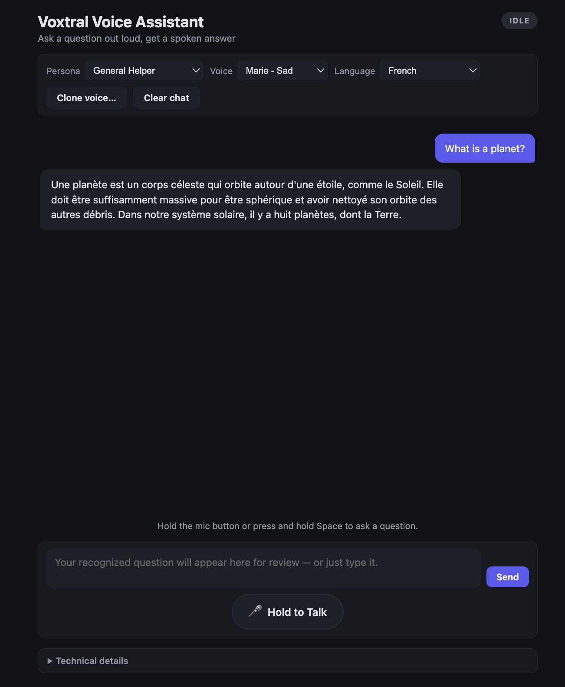

Project one in the Mistral course turned out to be the subtitle tool I wrote about [last time](/posts/2026-06-12-building-the-subtitle-tool). Project two showed up right after, and its spec pointed straight at a question I'd been sitting on since [my first post about Mistral](/posts/2026-06-06-first-steps-with-mistral): Could I build something where you ask a question in one language and get the answer back in another, in a voice that still sounds like a real person?

The answer turned out to be yes, but not in the way I expected, and getting there meant running straight into one of those facts about a model that you only discover by trying the thing it's supposedly capable of and watching it not quite work.

The app itself is a turn-based voice assistant: hold a button, ask a question out loud, watch the recognized transcript appear, hear a spoken answer back.

```
mic audio -> Voxtral Realtime STT -> editable transcript
           -> mistral-small-latest -> Voxtral TTS -> playback
```

"Turn-based" is a deliberate constraint from the spec, not a limitation I ran into. A full duplex agent, one that listens while it's also talking and can be interrupted mid-sentence, is a much harder system to build and a much easier one to get wrong. The course spec called for something that "should feel like a practical voice FAQ or helper assistant rather than an experimental demo," and turn-based is what makes that achievable: you speak, it processes, it answers, and the state is always one of a small fixed set. The code's on [GitHub](https://github.com/gjack/voice-assistant) if you want to dig through it yourself.

---

## A State Machine You Can Actually Point To

The whole app is built around one idea: at any moment, the session is in exactly one of `idle`, `listening`, `transcribing`, `thinking`, `speaking`, or `error`. Not "roughly listening," not two things at once. One state, always known, always sent to the frontend the moment it changes:

```python
async def send_state(ws: WebSocket, state: SessionState, new_status: str):
    state.status = new_status
    await ws.send_json({"type": "state", "state": new_status})
```

The frontend doesn't infer state from a pile of booleans; it just renders whatever the server tells it. A badge updates, a hint sentence below it changes, and buttons enable or disable themselves:

```javascript
export function setState(state) {
    currentState = state;
    renderBadge(state);

    const isIdle = state === "idle";
    talkBtn.disabled = !isIdle;
    sendBtn.disabled = !isIdle;
    transcriptInput.disabled = !isIdle;
    stopBtn.hidden = state !== "speaking";
}
```

This sounds almost too simple to mention, but it's the thing that made the rest of the app easy to reason about. Every bug I ran into while building this had an obvious shape once I knew which of six states it happened in. Compare that to the subtitle tool's realtime side, where partial text could be flickering in at any moment regardless of what else was happening. There, the looseness was the point. Here, the rigidity is.

---

## Push, Talk, Then Stop and Wait

Holding the talk button (or holding Space, the keyboard shortcut) starts capture exactly the way the subtitle tool's microphone input did: 32-bit float samples from `getUserMedia`, rescaled into 16-bit PCM, shipped over a WebSocket. I won't repeat that conversion here since I walked through it last time, but it's worth noting the capture only runs while a flag is true:

```javascript
processorNode.onaudioprocess = (e) => {
    if (!streamingAudio || !isOpen()) return;
    const float32 = e.inputBuffer.getChannelData(0);
    const int16 = new Int16Array(float32.length);
    for (let i = 0; i < float32.length; i++) {
        const s = Math.max(-1, Math.min(1, float32[i]));
        int16[i] = s < 0 ? s * 0x8000 : s * 0x7fff;
    }
    sendBinary(int16.buffer);
};
```

What's different from the subtitle tool is what happens on the backend once the button comes back up. In the realtime subtitling app, two async tasks raced each other and whichever finished first triggered cleanup for both, because either side (user clicking Stop, or a connection error) could legitimately end things first. Here there's a clear order, because there's a clear trigger: the button being released.

```python
receive_task = asyncio.create_task(receive_audio())
events_task = asyncio.create_task(process_events())

# Wait for the client to release the talk button (or disconnect).
await receive_task
await send_state(ws, state, "transcribing")

try:
    await asyncio.wait_for(events_task, timeout=ASR_TRANSCRIPT_TIMEOUT_S)
except asyncio.TimeoutError:
    events_task.cancel()
```

`receive_audio` forwards mic bytes to Voxtral until it sees a `stop_listening` control message, then flushes and ends the audio stream. Only once that's done does the state flip to `transcribing` and the app waits (with a timeout, in case Voxtral never sends a final event) for `process_events` to produce the finished transcript. Sequential, not racing, because in a push-to-talk flow there's only one thing that can end the turn.

---

## The Transcript You're Allowed to Argue With

Here's the part of the spec I didn't expect to matter as much as it did: the two-phase flow, where you review and edit the recognized transcript before it's sent to the LLM. Not a single pipeline from speech to answer, but a deliberate pause in the middle where the recognized text sits in an editable box and waits for you to either fix it or send it as-is.

```python
state.pending_user_text = normalized
await ws.send_json({"type": "transcript", "text": normalized})
await send_state(ws, state, "idle")
```

Notice that last line: after transcription finishes, the state goes back to `idle`, not straight to `thinking`. Nothing happens automatically. The transcript lands in the input box, and the app just waits for you to either edit it or hit Send (or Enter). It's a small interaction choice, but it changes the feel of the whole thing from "an agent that's listening to everything I say" to "a tool that heard something and is checking with me before it acts on it." Given that Voxtral can occasionally mis-hear a word, especially with an accent (something I ran into directly with the subtitle tool's "voice" becoming "both"), having a checkpoint before that mistake gets sent to an LLM and read back to me out loud felt like the right default, not an extra feature.

---

## One Endpoint, Four Personalities

Once a transcript is sent, `handle_response` in `conversation.py` takes over: build a prompt from the current persona, call `mistral-small-latest`, then hand the answer to TTS.

```python
preset = PRESETS.get(state.preset, PRESETS[DEFAULT_PRESET])
system_prompt = preset["system_prompt"]

messages = [{"role": "system", "content": system_prompt}]
messages.extend(state.history[-RESPONSE_CONFIG["history_limit"]:])

response = await asyncio.to_thread(
    client.chat.complete,
    model=LLM_MODEL,
    messages=messages,
    max_tokens=RESPONSE_CONFIG["max_tokens"],
    reasoning_effort=preset["reasoning_effort"],
)
```

The four starter personas (`helper`, `tutor`, `course`, `sarcastic`) are just different system prompts and a different `reasoning_effort` per preset, the same parameter from the first Mistral exercise I wrote about: a quick factual answer doesn't need much thought, but "Technical Tutor" is set to `"high"` because explaining something step by step benefits from the model actually working through it first. Having that as a structured field on the preset, rather than a setting buried somewhere else, made it trivial to give each persona a different cost/depth tradeoff without touching any of the orchestration code.

`asyncio.to_thread` is doing a quiet but necessary job in both this call and the TTS call a few lines later: the Mistral SDK calls here are synchronous, and the rest of the server is one async event loop. Without offloading them to a thread, a single slow chat completion would block every other WebSocket connection on the server, not just the one waiting on it.

---

## Telling It What Language to Answer In, Without a Language Parameter

This is where the part I actually cared about lives. I added a language dropdown: English, French, Spanish, German, Italian, Portuguese, independent of whatever language you spoke or typed in. Ask in English, get the answer in Spanish. The twist is that Voxtral's TTS API has no language parameter at all; it just speaks whatever text it's given, in whatever language that text happens to be. So "respond in a different language" can't be a TTS setting. It has to happen one step earlier, in the system prompt the LLM sees:

```python
if state.language != "auto":
    language_label = LANGUAGES.get(state.language, {}).get("label", state.language)
    system_prompt += (
        f"\n\nAlways respond in {language_label}, regardless of what "
        "language the user writes or speaks in."
    )
```

The LLM does the translation as a side effect of generating its answer, and the TTS model never knows or cares that a translation happened; it just gets handed Spanish text and reads it. That part worked immediately and felt like a clean trick. What I didn't expect was what happened to the *voice* once it started speaking a language it wasn't built for.

I picked a default English voice, asked a question, and set the language dropdown to Spanish. The transcript came back correctly translated. The audio played. And the voice reading it back to me sounded unmistakably like a British person reading Spanish off a page, technically correct words, completely wrong cadence and vowel sounds. It wasn't broken, it just didn't sound native, and once I noticed it I couldn't stop noticing it.

Digging into why led to a field I'd glossed over while building the voice list: `client.audio.voices.list()` returns a `languages` tag per voice, things like `en_us`, `en_gb`, `fr_fr`. Only English and French have built-in voices with a tag that matches them natively. Spanish, German, Italian, and Portuguese don't have a single built-in voice tagged for them at all, which means whatever voice you've selected gets used anyway, accent and all:

```python
LANGUAGES = {
    "auto": {"label": "Auto (match user)", "voice_tags": []},
    "en": {"label": "English", "voice_tags": ["en_us", "en_gb"]},
    "fr": {"label": "French", "voice_tags": ["fr_fr"]},
    "es": {"label": "Spanish", "voice_tags": []},
    "de": {"label": "German", "voice_tags": []},
    "it": {"label": "Italian", "voice_tags": []},
    "pt": {"label": "Portuguese", "voice_tags": []},
}
```

The frontend uses those tags to filter the voice dropdown down to accent-matching options whenever they exist, and to show a hint when they don't:

```javascript
const noNativeVoice = lang !== "auto" && tags.length === 0;
voiceHint.hidden = !noNativeVoice;
if (noNativeVoice) {
    voiceHint.textContent =
        `No built-in voice is native to ${label}. For a more natural accent, ` +
        `try "Clone voice…" with a ${label} speaker clip.`;
}
```

That hint is the whole answer: for a language with no native built-in voice, the only way to get a native-sounding accent is to clone one. So I did. I recorded ten seconds of myself speaking Spanish, my actual native language, and uploaded it through the clone button. That request doesn't go through the paid `voices.create()` endpoint; it uses `ref_audio`, a base64-encoded clip that works on the free plan and lasts only for the lifetime of the running server process:

```python
@router.post("/api/clone-voice")
async def clone_voice(file: UploadFile = File(...)):
    audio_bytes = await file.read()
    ref_audio_b64 = base64.b64encode(audio_bytes).decode("ascii")
    clone_id = f"clone:{uuid.uuid4().hex[:8]}"
    CLONED_VOICES[clone_id] = ref_audio_b64
    return {"id": clone_id, "name": f"Cloned ({file.filename})"}
```

```python
tts_kwargs = {"model": TTS_MODEL, "input": answer, "response_format": "mp3"}
if state.voice_id and state.voice_id.startswith("clone:"):
    tts_kwargs["ref_audio"] = CLONED_VOICES.get(state.voice_id)
elif state.voice_id:
    tts_kwargs["voice_id"] = state.voice_id
```

I selected my own cloned voice, asked a question in English, set the response language to Spanish, and the answer came back in my own voice, speaking fluent, natively-accented Spanish, words I never actually said. Ten seconds of audio was enough. It's the same trick from the very first Mistral exercise that stopped me in my tracks, except this time it wasn't a scripted demo I was watching happen. It was an app I'd built, doing it on a question I made up on the spot, in a voice that was unmistakably mine.

---

## What It's Like to Use



Open the app, hold the talk button, ask something. The badge moves through Listening, Transcribing, Thinking, Speaking, in that order, every time, no ambiguity about what's currently happening. The recognized transcript lands in an editable box; you can fix a mis-heard word before it goes anywhere. Pick a persona and the same question gets a noticeably different answer: dry and short from Sarcastic Dev, patient and stepwise from Technical Tutor. Pick a response language other than your own and the assistant translates on the way out, voice and all.

None of the individual pieces are new technology. Speech recognition, chat completion, and text-to-speech all exist on their own. What stood out to me here was how much of building this was about composing three separate models into one coherent turn, and how a tiny detail buried in a voice's metadata (a `languages` tag most people would never look at) ends up being the difference between an app that translates and an app that actually sounds like it belongs in the language it's speaking.

---

## What I'm Curious About Next

The non-goals list for this version was explicit: no barge-in, no interrupting the assistant mid-answer, no full duplex conversation. That was the right call for getting a stable v1 working, but now that it exists, the constraint is the thing nagging at me.

Right now, if the assistant gives a long answer in Technical Tutor mode and I already understood the first sentence, my only option is to let it finish or hit Stop and lose the rest. A real conversation doesn't work that way; people interrupt, redirect, and talk over each other constantly, and a voice assistant that can't tolerate any of that still feels like it's reading at you rather than talking with you.

I don't know yet whether that's a small change (listen for audio input while `speaking`, treat it as an immediate cancel-and-restart) or a much bigger one (actual overlapping audio, deciding what to do with a half-finished answer the user talked over). That's the next thing I want to find out.
