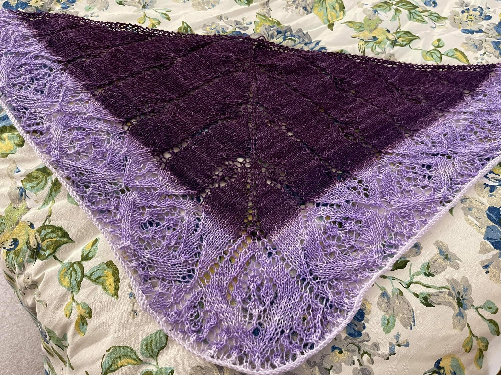
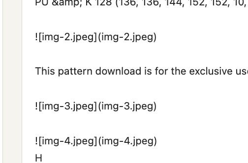
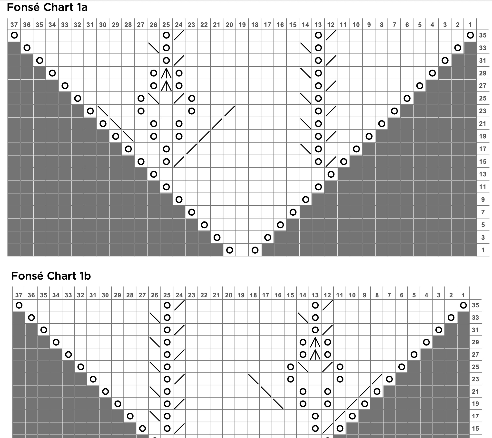
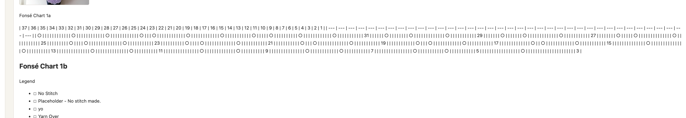
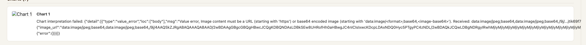

Knitting is one of my favorite hobbies. I've been doing it long enough to accumulate a library of patterns, mostly from [Knitpicks](https://knitpicks.com), my favorite yarn and pattern store, and a corresponding pile of frustrations with how those patterns are structured. A knitting pattern isn't a recipe you read once and put away. You're consulting it mid-project, row by row, trying to remember what "K2tog SSK" means, cross-referencing a chart with an abbreviations table on a different page, searching for the needle size on page one while your hands are covered in fiber. It's a document format designed to be printed and held, not searched or queried.

One of the projects in the Mistral course I've been going through was a homework assistant for children with dyslexia. The idea: take a photo of a homework assignment, send it through the vision model, and have the assistant interpret the content and answer the child's questions about it. Image in, understanding out, chat on top. The mechanics were straightforward, but the concept stuck with me. Could the same approach work with a PDF instead of a photo? Could I build something that ingests a knitting pattern, understands its structure, and then answers specific questions grounded in what's actually in the document? Not generic knitting knowledge, but *this* pattern?

That's what I've been building. I've only tested it against patterns from Knitpicks so far; it's what I have. This post covers the first part: getting the PDF in. I'll start by walking through the code as it stands now, then get into the debugging session that shaped it, because the final version only makes sense once you've seen what it had to work around.

---

## The App

The backend is a FastAPI server; the frontend is React. The server exposes four REST endpoints: upload a pattern, list patterns, get a pattern, and delete a pattern. There's also a WebSocket stub that will eventually handle real-time voice queries. Uploaded patterns are stored on disk under a `library/` directory, one subdirectory per pattern, each containing the original PDF, the extracted chart images as JPEGs, and a `document.json` with everything the pipeline produced.

The upload endpoint is the only interesting one right now:

```python
@router.post("/api/upload")
async def upload_pattern(file: UploadFile = File(...)):
    if not file.filename.lower().endswith(".pdf"):
        raise HTTPException(status_code=400, detail="Only PDF files are supported.")
    pdf_bytes = await file.read()
    doc = await process_pdf(pdf_bytes, file.filename)
    return JSONResponse(content=doc)
```

Everything interesting happens in `process_pdf`. The full code is on [GitHub](https://github.com/gjack/knitting-assistant) if you want to follow along.

---

## The Ingestion Pipeline

`process_pdf` in `pattern_processor.py` runs three things in sequence: OCR, metadata extraction, and chart interpretation.

### Step 1: OCR

```python
pdf_b64 = base64.b64encode(pdf_bytes).decode()
ocr_response = await asyncio.to_thread(_ocr_pdf_sync, pdf_b64)
```

```python
def _ocr_pdf_sync(pdf_b64: str) -> object:
    return client.ocr.process(
        model="mistral-ocr-latest",
        document=DocumentURLChunk(document_url=f"data:application/pdf;base64,{pdf_b64}"),
        include_image_base64=True,
    )
```

`mistral-ocr-latest` processes the full PDF and returns each page's content as a markdown string, plus a list of images it extracted from that page (each with a base64-encoded JPEG and bounding box coordinates). The `include_image_base64=True` flag is what gets you the actual image data rather than just references.

After OCR, the page markdowns are cleaned up and joined into a single `raw_text` string. Some things get stripped or replaced during cleaning. These were decisions that came out of the debugging session, not the initial build.

### Step 2: Metadata Extraction

With the raw text in hand, a chat call extracts the structured fields a knitter actually needs:

```python
def _extract_metadata_sync(raw_text: str) -> dict:
    resp = client.chat.complete(
        model="mistral-small-latest",
        messages=[
            {"role": "system", "content": METADATA_SYSTEM_PROMPT},
            {"role": "user", "content": raw_text},
        ],
        response_format={"type": "json_object"},
    )
    return json.loads(resp.choices[0].message.content)
```

The system prompt tells the model exactly what to extract:

```python
METADATA_SYSTEM_PROMPT = """You are a knitting pattern parser. Extract the following fields as JSON:
title (string), sizes (list of strings), gauge (string), needles (list of strings),
yarn (string or list), abbreviations (list of {symbol: string, meaning: string}),
sections (list of section title strings).
If a field is not present in the pattern, use null or an empty list.
Return only valid JSON."""
```

`response_format={"type": "json_object"}` forces the output to be valid JSON, so there's no need to parse freeform text. The result (title, sizes, gauge, needles, yarn, abbreviations, sections) is what the frontend's pattern info panel displays.

### Step 3: Chart Interpretation

Knitting patterns contain two kinds of images worth interpreting: schematics (technical line drawings of garment shapes with labeled measurements) and stitch charts (grids of symbols representing individual stitches). Both need a plain-English description that a user can actually read, especially charts, which are otherwise meaningless without the physical grid in front of you.

Each image extracted by OCR gets sent to the vision model:

```python
def _interpret_chart_sync(chart_image, title: str, legend_text: str) -> dict:
    prompt = (
        f"This image is from the knitting pattern '{title}'. "
        f"Knitting PDFs contain several types of images. Identify which this is:\n\n"
        f"- SCHEMATIC: a technical line drawing with labeled measurements. "
        f"List every labeled measurement exactly as shown.\n"
        f"- STITCH CHART: a grid of symbols representing individual stitches row by row. "
        f"Use the pattern legend ({legend_text}) to describe the stitch pattern "
        f"and give a row-by-row reading in words (e.g. 'K1, YO, K2tog, repeat to end'). "
        f"Do not reproduce the grid as ASCII art, a table, or a row of symbols.\n"
        f"- OTHER: a photo or decorative image. Describe what you see.\n\n"
        f"Start with the image type, then give the description."
    )
    resp = client.chat.complete(
        model="mistral-small-latest",
        messages=[{"role": "user", "content": [
            {"type": "text", "text": prompt},
            {"type": "image_url", "image_url": _to_data_url(chart_image.image_base64)},
        ]}],
        max_tokens=600,
    )
    return {"id": chart_image.id, "base64": ..., "description": ..., "bounding_box": ...}
```

The legend text (built from `metadata.abbreviations`) is passed in so the model knows what the symbols mean when it encounters a stitch chart. All chart interpretations run in parallel with `asyncio.gather`.

### What Gets Saved

At the end of `process_pdf`, everything lands in one JSON document:

```python
doc = {
    "pattern_id": pattern_id,
    "filename": filename,
    "upload_date": upload_date,
    "raw_text": raw_text,
    "metadata": metadata,
    "chart_images": chart_results,
    "pattern_document": pattern_document,
    "chat_history": [],
}
```

`pattern_document` is `raw_text` with the chart descriptions appended as an extra section. This is what will eventually go into the RAG index. `chat_history` starts empty and is where the conversation will accumulate.

---

## Then the Debugging Started

I uploaded a real Knitpicks pattern to test it: the [Fonsé Shawlette](https://www.knitpicks.com/fonse-shawlette-free-knitting-pattern/p/55951), the one for the shawl below that I finished last year.



The "Pattern Text" panel looked nothing like a pattern. Three things were wrong.

---

### Bug 1: The Frontend Was Ignoring Markdown Entirely

Strings like `` were sitting in the text as literal characters. `&amp;` appeared where `&` should be.



Mistral OCR returns each page as markdown. The frontend was dropping that string into a plain `<div>` text node with no parsing at all. Image references displayed as text, HTML entities were never decoded, and pipe tables rendered as a wall of `|` characters.

The fix: replace the text node with `react-markdown`, with a custom `img` component that maps each `img-N.jpeg` reference back to the matching entry in `chart_images` by id and renders the actual base64 image inline. GFM table support required adding `remark-gfm` explicitly. Entity decoding came for free.

---

### Bug 2: The Charts OCR Couldn't Find

Chart 1a of the [Fonsé Shawlette](https://www.knitpicks.com/fonse-shawlette-free-knitting-pattern/p/55951) pattern showed up as a giant wall of `|`, `○`, and `---` characters. Chart 1b didn't appear at all, just its heading and then the next section. Here's what those two charts actually look like in the pattern PDF:



And here's what the app was showing instead:



Some of the other charts produced a different kind of failure entirely: the chart interpretation step threw an error because the base64 image data was being double-prefixed, arriving at the API as `data:image/jpeg;base64,data:image/jpeg;base64,...`. That was caught early and fixed with a simple guard in `_to_data_url`.



My first guess for the garbled charts was that the images hadn't been extracted from the PDF. I ran `pdfimages -list` against the source file. Five raw embedded raster images in the whole PDF. The pipeline had produced ten `chart_images` entries.

That mismatch was the key. Mistral OCR isn't pulling image objects out of the PDF's internal structure. It's visually segmenting each rendered page and deciding for each region whether it looks like "an image," "a table," or "text." That judgment is its own inference step, and it's not deterministic. Running the same PDF through the pipeline multiple times gave different results each time.

On the page with charts 1a and 1b, the heuristic had failed in two different ways. For Chart 1a: it decided the chart grid was a table and transcribed it as markdown, one symbol per cell. Visually identical structure to the original grid, completely unreadable as text. For Chart 1b: it produced nothing at all.

The fix is two cheap, deterministic checks in `pattern_processor.py` that run after OCR, before any extra API calls:

```python
def _is_garbled_chart_table(lines: list[str]) -> bool:
    cells = []
    for line in lines:
        stripped = line.strip()
        if re.fullmatch(r"\|?\s*-{2,}\s*(\|\s*-{2,}\s*)*\|?", stripped):
            continue
        cells.extend(c.strip() for c in stripped.strip("|").split("|"))
    if len(cells) < 8:
        return False
    symbolish = sum(1 for c in cells if c == "" or len(c) <= 2)
    return symbolish / len(cells) > 0.85
```

A real knitting chart grid is almost entirely single symbols, blanks, and short numbers. If more than 85% of a table's cells are two characters or fewer, it's a misclassified chart grid, not prose. The second check looks for chart headings whose following section contains neither an image reference nor any table at all.

For every page flagged by either check, the pipeline renders that page with PyMuPDF at 3x zoom and sends it through the vision model again, with a prompt that names the specific charts OCR lost and asks for a row-by-row reading.

Getting that fallback prompt right took two rounds. The first version said "describe this chart." The model's response was a code block of `O` characters, the exact same unreadable failure as the original OCR bug, just moved one layer up. The prompt now explicitly says: describe rows in words like "K1, YO, K2tog, repeat to end," not as ASCII art, not as a table, not as a row of symbols. A second issue came up when a single page had three named charts (3a, 3b, 3c): the model would write a full description for one and gesture vaguely at the others. The prompt now names exactly how many charts to cover and requires a dedicated section for each, with `max_tokens` scaled accordingly.

---

### Bug 3: The Abbreviations Table, Twice

After fix #1, a different kind of garbled text appeared: the abbreviations section rendered as one long run of pipe characters.

Two separate causes. First, `remark-gfm` (which handles pipe tables) hadn't been added yet, so any pipe table in the OCR'd text silently fell back to being treated as a plain paragraph of `|` and `-` characters. That was fixed as part of Bug 1.

Second: even once the table parsed correctly, this specific one was bad to display. Mistral OCR had transcribed the pattern's printed abbreviations glossary as a wide table with four symbol/meaning pairs per row, an artifact of the PDF's multi-column print layout. That data was already cleanly extracted into `metadata.abbreviations` and already displayed as a proper two-column table in the "Abbreviations & Legend" panel above it. Showing the OCR version again was just noise.

The fix strips any table whose first header cell is literally "Abbreviations" from the pattern text and replaces it with a short pointer to the existing panel. Not a generic reflow algorithm; the content is redundant, so removing it is simpler than reformatting it.

---

## What This Taught Me About Building on Top of OCR

The lesson across all three bugs: Mistral OCR isn't a reliable pre-processing step you can trust once and move on from. It makes its own inference decisions about page layout (what's an image, what's a table, what's text) and those decisions are probabilistic and inconsistent across runs of the same document. Any pipeline built on top of it needs to treat the output as a draft that requires validation, not a clean extraction.

I've only tested this with Knitpicks patterns. That's a fairly consistent layout and print style, and I don't know yet how much of this would hold up against patterns from other publishers with different conventions.

There are a few other untested shapes worth noting. Every PDF I've used so far contains a single pattern, which is how Knitpicks distributes most of their individual designs. But they also sell whole pattern books as PDFs, and that's a meaningfully different problem: the pipeline currently assumes one pattern per document, so the metadata extraction and chart interpretation would need to be rethought to handle a multi-pattern file correctly. Similarly, the pipeline hasn't been tested on scanned PDFs, patterns photocopied from a book or magazine and saved as a PDF. Those tend to be lower resolution and may have artifacts that affect how OCR segments the page, especially for chart grids where the symbol density is already right at the edge of what the heuristics can handle.


---

## What's Next

The ingestion pipeline now produces a document I'm reasonably confident is accurate for the patterns I've tested. Next is the part I actually wanted to build: a chat interface that answers questions grounded in the specific pattern. Not "what does YO usually mean in knitting" from general knowledge, but "what does YO mean in this pattern, according to the abbreviations table." That means building the RAG layer on top of what the ingestion pipeline produces.
