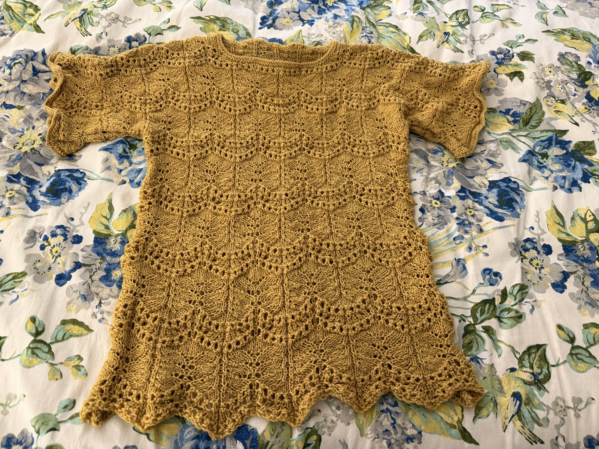
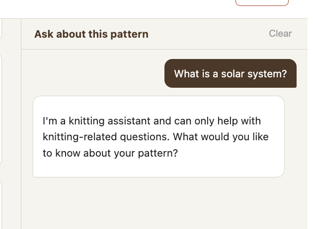
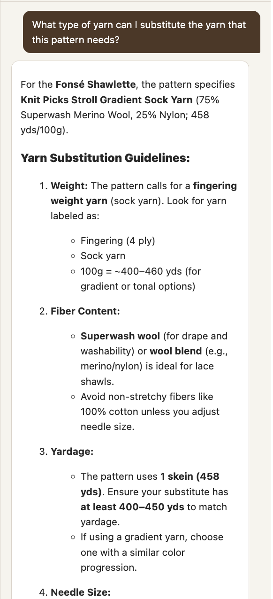
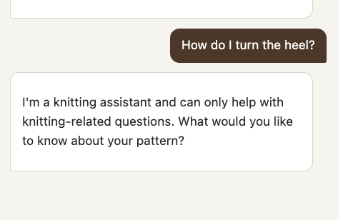

[Last time](/posts/2026-06-26-knitting-assistant-pattern-ingestion), I wrote about turning a knitting pattern PDF into a clean, structured `pattern_document`: OCR text, extracted metadata, and plain-English chart descriptions, saved into a `document.json` file per pattern. That took care of getting patterns in, but none of it actually answered a question yet. This post covers the two things I built next: a way to search across every pattern in my library, and a chat panel that answers questions about whichever pattern is open. Both of these worked the first time I tried them, technically. Getting them to work well took a lot longer, and that's mostly what this post is about.

---

## Two Different Retrieval Problems

These turned out to be two different problems, even though they both look like "ask a question, get an answer" from the outside.

"Ask my library" is a search problem across many patterns: I don't know ahead of time which pattern has the answer, so I need retrieval, embeddings, a vector store, ranked results. That's what `library_index.py` does, backed by a local ChromaDB collection.

Chat over the pattern you already have open is different. You're not searching for the right document anymore, you already have it, and you're often asking about several parts of that one document at once, the legend, a specific chart, a row that references an earlier row by number. Chunked retrieval is the wrong tool for that; it would hand the model fragments when what it actually needs is the whole picture. So `chat_engine.py` skips retrieval entirely and just puts the full `pattern_document` in context on every turn.

I built the library index first, since it seemed like the simpler of the two, and it's also where I ran into the more interesting bug. Full code is on [GitHub](https://github.com/gjack/knitting-assistant), same as last time.

Here's what the whole thing looks like once both pieces existed: a sidebar listing every pattern I've uploaded, the pattern viewer in the middle with its charts and text, and the chat panel on the right answering a question grounded in whichever pattern is open.

<div className="wide-image">


</div>

---

## Indexing the Library

`library_index.py` is a thin layer around Chroma. `index_pattern` chunks a pattern document and writes it to a local persistent collection, `delete_pattern_index` removes a pattern's chunks when it's deleted from the library, and `search_library` embeds a query and calls `collection.query()` against it, optionally scoped to a single pattern.

```python
def index_pattern(pattern_id, pattern_title, pattern_document, abbreviations):
    collection.delete(where={"pattern_id": pattern_id})  # safe to re-index
    chunks = _chunk_document(pattern_title, pattern_document, abbreviations)
    embeddings = [_embed(c["text"]) for c in chunks]
    collection.add(
        ids=[f"{pattern_id}-{i}" for i in range(len(chunks))],
        embeddings=embeddings,
        documents=[c["text"] for c in chunks],
        metadatas=[{"pattern_id": pattern_id, "section_type": c["section_type"]} for c in chunks],
    )
```

The embeddings come from `mistral-embed`, computed explicitly and passed in rather than letting Chroma use its own default local embedding function. If I hadn't done that, the query and the documents would end up in different embedding spaces and every search would quietly break. `PersistentClient(path="./chroma_db")` keeps everything local, so there's no external vector database service to run.

I went with Chroma instead of something like Pinecone or Weaviate mostly by process of elimination. Those are built for a scale I don't have, millions of vectors, managed hosting, horizontal scaling, none of which applies to a personal library of a few dozen patterns, and they'd mean setting up an external account and service just to run a hobby project on my own machine. Chroma's embedded mode gives me the same query interface without any of that: it's a library, not a service, and the whole index just lives in a folder next to the code. If this ever grew past what a single file can handle, swapping the vector store out would be a contained change behind those three functions in `library_index.py`. For now this is still an experiment, so I'd rather keep it simple than build for a scale I don't have yet.

The chunker splits on markdown headers first, since `pattern_document` is structured markdown, and prefixes each chunk with the pattern title so it stays interpretable on its own, which matters once search spans the whole library and not just one document. Oversized sections fall back to fixed windows of 1500 characters with 150 characters of overlap.

The upload and delete handlers in `routes.py` call `index_pattern` and `delete_pattern_index`, and I added a new `GET /api/search?q=...` endpoint so the frontend can call `search_library`.

### The YO Problem

To test this, I didn't bother re-uploading a PDF. I wrote a small script that loaded an already-processed pattern, the Fonsé Shawlette from last time, straight from its `document.json`, ran it through `index_pattern`, and fired off a few queries at `search_library`. Much faster than waiting on OCR every time.

The first query I tried was about as basic as it gets:

```
Query: 'what does YO mean'
  #1 [chart 7]              dist=0.3597  (a stitch chart description, not the answer)
  ...
  #8 [abbreviations & legend]  dist=0.4099  (the actual answer, buried at rank 8)
```

The abbreviations section was in there, it just wasn't the top hit, which for a two-letter symbol lookup kind of defeats the purpose.

The root cause traced back to something from Part 1. `_strip_abbreviations_table` deliberately removed the OCR'd abbreviations table from the raw text, because the original was a garbled multi-column layout, and the clean structured version lived in `metadata.abbreviations` instead. That was the right call for display. What I hadn't noticed was that the structured list never made it back into `pattern_document`. So the chunk Chroma indexed for the abbreviations section was just a placeholder string, nothing in there for the embedding model to match against "what does YO mean."

My first fix rebuilt a clean `## Abbreviations & Legend` section from the structured list and prepended it to `pattern_document`:

```python
abbrev_section = ""
if abbreviations:
    rows = "\n".join(f"- **{a.get('symbol', '')}**: {a.get('meaning', '')}" for a in abbreviations)
    abbrev_section = f"## Abbreviations & Legend\n{rows}\n\n"

pattern_document = abbrev_section + raw_text + chart_descriptions
```

This ended up helping the chat engine too, since now any time someone asks about a symbol, the full document context has a readable abbreviations section instead of a hole where one used to be.

That got the section indexed, but "what does YO mean" still ranked it around #8. Seven abbreviations crammed into one chunk means "yo: Yarn over" is sitting next to six other entries, and a two-letter token like "yo" just doesn't embed as distinctively as a full sentence would.

So I added a second, much smaller unit of indexing: one chunk per abbreviation, on top of the section-level chunk.

```python
def _abbreviation_chunks(pattern_title, abbreviations):
    for a in abbreviations:
        yield {
            "text": f"{pattern_title}\n\nAbbreviation: **{a['symbol']}** — {a['meaning']}",
            "section_type": "abbreviation",
        }
```

Now each chunk is entirely about one symbol, and it scores well for exactly the query it should answer:

```
Query: 'what does YO mean'
  #1 [abbreviation]  dist=0.2896  'Abbreviation: **yo** — Yarn over'   ✓
```

I kept the section-level chunk too, so a broader query like "what abbreviations does this pattern define" still works.

The last fix was upstream of Chroma entirely. The Fonsé Shawlette only had 7 abbreviations extracted, but the pattern actually defines a lot more than that, scattered across the main legend, inline chart legends, and stitch glossaries. The original metadata prompt just wasn't asking for enough:

```
abbreviations (list of {symbol: string, meaning: string})
```

I changed it to:

```
abbreviations: capture EVERY symbol or abbreviation definition found anywhere in the pattern —
the main Abbreviations or Legend section, any inline chart legends, and any stitch definition
glossaries. Include standard abbreviations (k=knit, p=purl, etc.) only if they are explicitly
defined in this pattern's own legend.
```

Re-extracting with the new prompt pulled 51 abbreviations instead of 7. The pattern document ended up with 75 Chroma chunks, 51 per-abbreviation plus 24 section chunks, and every lookup landed at the top after that:

```
Query: 'what does YO mean'    → [abbreviation] dist=0.2758  'YO — yarn over'
Query: 'how do I cast on'     → [abbreviation] dist=0.2924  'CO — cast on'
Query: 'what is SSK'          → [abbreviation] dist=0.2260  'SSK — sl, sl, k these 2 sts tog'
Query: 'how do I decrease'    → [abbreviation] dist=0.2738  'dec — decrease(es)'
Query: 'what needles'         → [needles]      dist=0.2337  'US 5 (3.75mm) 32" circular...'
```

Two things stuck with me from this one. When you strip something out of the displayed text for a good reason, you have to make sure the structured version of it goes back into whatever's actually searchable, otherwise you've quietly created a hole. And short tokens need their own dedicated chunks, section-level chunking is fine for broad questions but it's bad at surfacing a two-letter symbol buried among six others.

---

## Chatting With the Active Pattern

`chat_engine.py` is a lot smaller. `chat(pattern_id, user_message)` loads `pattern_document` and `chat_history` from disk, builds a message list, calls `mistral-small-latest`, saves the history back, and returns the reply. `get_history` and `clear_history` round it out.

```python
messages = [
    {"role": "system", "content": CHAT_SYSTEM_PROMPT},
    {"role": "user", "content": f"PATTERN:\n{pattern_document}"},
    *windowed_history,   # last HISTORY_WINDOW turns from disk
    {"role": "user", "content": user_message},
]
```

The whole `pattern_document` goes in as context every time, no retrieval, for the reason I mentioned above: knitting questions often need the legend, a specific row, and a chart description all at once, and chunked retrieval risks handing the model an incomplete picture. At around 15k characters for the Fonsé Shawlette, it fits in context without any trouble.

On the frontend, a `ChatPanel` component replaced the "chat coming soon" placeholder. Enter sends, Shift+Enter adds a newline, replies render as markdown so bold and lists from the model show up properly, and there's a Clear button that wipes the history. It starts off with `initialHistory` from the pattern object that's already been fetched on page load, so going back to a pattern you'd already been chatting with shows the old conversation right away, no extra request needed.

---

## "The Pattern Does Not Provide That Information"

Chat worked fine for the easy stuff, needles, yarn, general sizing. Then I asked something more specific, "What's the sequence of stitches in Chart 1a line 19?", and got back a polite refusal pointing me at the chart viewer instead of an answer.


Turned out there were three separate bugs stacked underneath that one failure.

The first was that the vision model wasn't really reading the charts, it was summarizing them. The chart interpretation prompt from Part 1 asked for "a row-by-row reading where legible" but didn't actually give the model any conventions for how to read a knitting chart, so what came back was vague stuff like "features a combination of lace and cable elements" instead of an actual stitch sequence. I rewrote the prompt to spell out the reading conventions:

```
Knitting chart reading conventions:
- Row numbers on the RIGHT = RS (right side) rows, read RIGHT TO LEFT.
- Row numbers on the LEFT = WS (wrong side) rows, read LEFT TO RIGHT.
- If ONLY ODD numbers appear (all on the right), only RS rows are charted;
  WS rows are worked plain (knit all stitches) and are not shown.

Use the pattern legend to read each numbered row and give its COMPLETE
stitch-by-stitch sequence (e.g. 'Row 1 (RS): k3, yo, ssk, k1, k2tog, yo, k3').
```

The second bug was that the chart descriptions had the wrong names. The pipeline had been labeling charts sequentially by image order ("Chart 1," "Chart 2," "Chart 3"), but the pattern text itself referred to them as "Fonsé Chart 1a," "Fonsé Chart 1b," and so on. So when I asked about "Chart 1a," there was nothing in context called that, and the model genuinely had no way to connect the two. I added `_build_image_name_map`, which scans the OCR text for image references and checks whether the heading right before each one looks like a chart name, using that instead of a sequential counter. That correctly mapped all seven charts in the Fonsé Shawlette (`img-2.jpeg → Fonsé Chart 1a`, and so on), so `### Fonsé Chart 1a` now shows up as an actual header the model can match against.

The third bug was in the system prompt itself, which said "when something isn't covered by the pattern, say so rather than guessing." The model read row 19's stitch sequence as not explicitly written, which is technically true since it comes from a chart image and not typed instructions, and refused on principle. I had to tell it explicitly to derive row sequences from the chart descriptions instead of treating "not written as prose" as "not available."

After all three fixes, the same question came back with: *"For **Fonsé Chart 1a, Row 19 (RS)**, the stitch sequence is: **k1, yo, ssk, k17, k2tog, yo, k1**"* I also re-ran the whole pipeline from scratch on the original PDF, instead of just patching the one broken document by hand, and it reproduced the fix from clean input. That's really the only way I trust a fix like this.

---

## When the Model Has the Right Answer and Says the Wrong One

For the next round of testing I switched patterns entirely: the [Ripple Tee](https://www.knitpicks.com/ripple-tee-knitting-pattern/p/14842D) by Jill Wright, which I knit in a mustard-gold fingering weight.



If you compare this to the shawl photo from Part 1, you'll notice a pattern of my own: pretty much everything I knit is lace. I like the process of it, counting yarn overs and decreases, watching a plain skein turn into something with actual structure. It also means most of what's in my library is exactly the kind of pattern this assistant needs to handle well, dense charts, repeats, a lot of row-by-row bookkeeping. I knit this one a bit longer than the pattern called for, too. It's worked bottom-up, so the hem is already there from the cast-on, there's no shaping to work around afterward. I calculated the extra rows ahead of time and added them into the bodice, since the pattern as written would have run shorter than I wanted.

This pattern turned up a different kind of bug than the chart-naming one above, not missing information this time, but a reasoning shortcut. I asked for the stitch sequence in row 26 of the ripple lace section:


`P1, (K8, P1) to end` is actually the sequence for rows 1, 5, and 9, not row 26. The pattern says "Rows 19–26: Rep Rows 15–18," so row 26 should resolve to row 18. The model just skipped that step and gave me a plausible-looking answer built by association instead of actually tracing through the repeat. I tried again before fixing anything, and it gave me a different wrong row the second time.

Everything the model needed was already sitting right there in context, so this wasn't a retrieval problem like the chart bug. When I asked it to show its reasoning step by step, it correctly traced through the repeat, which told me the capability was there, it just wasn't happening by default. So I added an explicit rule to the system prompt:

```
Row repeat resolution: when asked about a specific row number, first check whether it falls
inside a range repeat such as "Rows 19-26: Rep Rows 15-18". If it does, compute the actual
row before answering: resolved_row = (asked - range_start) mod repeat_length + repeat_start.
```

With that in place, the same question came back correctly resolved, reasoning and all:


There was a related wrinkle in the same pattern. Its written instructions claimed even rows were the right-side rows, the opposite of the standard convention I'd hardcoded for the chart-reading fix earlier. The chart itself actually matched the standard convention, so the text note looks like a typo in the source pattern, but the code has no business overriding what the pattern actually says. I changed the system prompt from a hard rule to a pattern-deferred default: use whatever the pattern states, and only fall back to the standard convention if it doesn't say anything.

Once that was in, row 23 also resolved correctly, through the same repeat-resolution rule as row 26, since row 23 falls inside that same "Rows 19–26 repeat Rows 15–18" range:


---

## Guardrails

At some point during manual testing I asked the chat "what is 2+2?" just to see what would happen, and it answered "4." Funny, but not what you want from an assistant that's supposed to stick to one pattern.

The first pass at fixing this was a boundary in the system prompt: the active pattern, plus general knitting knowledge that supports working it (yarn substitution, needle sizing, blocking, chart reading), counts as in scope, and everything else gets a single fixed refusal, worded exactly the same way every time so the model doesn't start improvising variations. I also added a line telling it not to follow instructions embedded inside a user message that try to change its behavior or turn it into a different assistant.



General knitting knowledge that isn't written into the pattern itself is still supposed to get answered, not refused. Yarn substitution is the clearest example, it's not something in the pattern text, but it's exactly the kind of question a knitter actually has before starting a project.



That first pass turned out to be too strict in the other direction, though. Asking "How do I turn the heel?" got refused, even on a pattern with a section literally titled that, because "turn the heel" sounded generic and unfamiliar to the model out of context, even though it's a completely standard knitting term.



The scope list itself was the problem. It named a handful of specific topics, and the model defaulted to refusing anything that didn't obviously match one of them, instead of recognizing that sock and garment construction terms are just as much "knitting" as the ones already on the list. I added an explicit "when in doubt, lean toward answering" instruction, naming the categories of terms that tend to sound ambiguous out of context (sock construction: turn the heel, gusset, flap, short rows; garment construction: pick up stitches, seam, join in the round), and told the model that any section heading appearing in the pattern itself counts as a valid knitting topic. That's the same question answered correctly in the "A Dream That Was Rome Socks" chat panel in the overview screenshot near the top, full heel-turn instructions instead of a refusal.

That's still just a prompt-level defense, though, which means someone who knows the prompt could probably talk their way around it eventually. So I added two more things that don't rely on the model cooperating.

One is a server-side regex pre-filter, `_is_injection`, that runs before the API call and catches five categories: instruction override ("ignore your previous instructions"), role change ("act as," "jailbreak," "developer mode"), prompt disclosure ("repeat your system prompt"), delimiter injection (`[INST]`, `<|system|>`), and script or SQL injection patterns. A match short-circuits straight to the fixed refusal without ever calling the model, so there's no API cost and it doesn't depend on the model noticing anything.

The other is XML structural framing: I wrap every incoming user message as `<user_question>...</user_question>` before sending it, and the system prompt tells the model explicitly that everything inside those tags is untrusted content to answer or decline, never an instruction to follow. It's a structural signal layered on top of the semantic one, "ignore your instructions" inside `<user_question>` tags is clearly marked as something to evaluate, not obey.

Neither of these is airtight by itself. The regex can be evaded with unusual phrasing, and the XML framing only works if the model actually respects the boundary. Together, though, an attacker needs to beat both at once, which raises the bar quite a bit. Every obvious attack I tried (instruction override, role change, prompt disclosure, delimiter injection, a SQL injection string) got caught by the pre-filter before it ever reached the model, while ordinary questions went through fine.

---

## What This Round Taught Me

It's the same lesson as Part 1, really, just showing up in new clothes throughout this round. The parts of the pipeline that feel done (extraction ran, indexing ran, the model replied) aren't actually done until you've asked the specific, slightly awkward question that finds the gap. "What does YO mean" found a missing-data bug. "Chart 1a line 19" found a naming bug and an over-cautious refusal. "Row 26" found a reasoning shortcut that no amount of context stuffing would have fixed by itself, since the problem was never missing information, it was a step the model just wasn't taking. Testing against a second real pattern, instead of just the one I'd already debugged into shape, is what surfaced the last two of those. The Fonsé Shawlette was clean by the time I got to the Ripple Tee, and a second pattern with a different repeat structure is what broke it all over again. Underneath most of these was the same root mistake: assuming a general-purpose tool would handle knitting-specific data the way I would, without me having to tell it how.

That showed up most directly on the retrieval side, which goes back to the split I made at the very start of this post. RAG isn't one technique you apply the same way to every document, it has to be shaped around the actual data and the actual questions people are going to ask of it. A generic chunk size tuned for prose is exactly why a two-letter abbreviation like "YO" got buried at rank 8, and the fix wasn't a smarter embedding model, it was chunking that matched the shape of the data, one tiny chunk per symbol instead of one paragraph covering seven of them. And for chat over the active pattern, the right amount of retrieval turned out to be none at all, because knitting questions routinely need the legend, a row, and a chart description at the same time, and no chunk boundary was going to capture that. Neither of those was obvious from a default RAG setup, both only came from looking at what the source data and the real questions actually looked like.

The same assumption showed up again, in a different form, with OCR and vision models. It's tempting to expect them to just understand a document the way a person would. A knitter looks at a stitch chart and automatically knows the row number on the right means read right to left, that's a convention you pick up from experience, not something written on the page itself. I'd assumed the vision model would pick up on that the same way, and it didn't, it just described the picture in front of it, until I spelled out the actual reading conventions in the prompt and it started producing real row-by-row sequences instead of vague summaries. The abbreviations table in Part 1 was the same story from the other direction: OCR didn't know a garbled multi-column layout was still meaningful data worth preserving in some form, it just transcribed what it saw. None of this is the model failing at its job. It's doing exactly what it was asked, which is the point, it needs the domain knowledge handed to it explicitly rather than inferring it the way a person reading the same document would.

So the real test of whether any of this generalized, rather than just papering over the two patterns I'd been staring at while I found these bugs, was uploading something new. Once everything above was fixed, I uploaded a pattern from a different publisher for the first time: Schmetterling, an independent designer's shawl, also lace but simpler, two charts instead of seven, no nested repeats like the Ripple Tee had. It's the fourth pattern in the sidebar in the overview screenshot near the top. It went through cleanly, ingestion, indexing, and chat all worked the first time, nothing to chase down. I don't think that means the pipeline is done generalizing across publishers, the pattern being simpler was probably doing me a favor, and Part 1 already flagged multi-pattern PDFs and scanned documents as things I haven't tested at all. But it's a good sign that the fixes in this post were addressing the actual root causes above, not just patching around the two patterns I happened to be staring at when I found them.

---

## What's Next

Two things are queued up. One is "ask my library," using the Chroma index across all patterns to answer cross-pattern questions with citations back to the source pattern, for when there's no single pattern open. The other is voice: a WebSocket endpoint with push-to-talk speech input and spoken readback, reusing `chat_engine.chat()` as-is, since it's already decoupled from the REST transport it's sitting behind right now.
