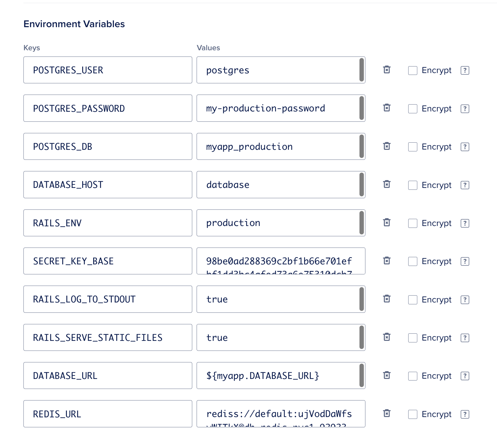

As I continued following along the tutorial from the book [Docker for Rails Developers](https://pragprog.com/titles/ridocker/docker-for-rails-developers/), 
it was about to become evident that a lot had changed since it was written. By now, my little sample application had grown. I added a database 
and scaffolded a User model and controller, just to confirm I was able to create, edit and delete records. I also added React and wired up a very simple 
component. Lastly, I setup a page that used Redis to increment a counter, just to confirm that the application was able to connect to the Redis service.

By then, my Dockerfile was looking like this:

```dockerfile
FROM ruby:2.7

# Allow apt to work with http-based resources
RUN apt-get update -yqq && apt-get install -yqq --no-install-recommends \
apt-transport-https

RUN curl https://deb.nodesource.com/setup_12.x | bash
RUN curl https://dl.yarnpkg.com/debian/pubkey.gpg | apt-key add -
RUN echo "deb https://dl.yarnpkg.com/debian/ stable main" | tee /etc/apt/sources.list.d/yarn.list

RUN apt-get update -yqq && apt-get install -yqq --no-install-recommends \
nodejs \
yarn \
&& rm -rf /var/lib/apt/lists/*

WORKDIR /usr/src/app
COPY Gemfile* /usr/src/app/

ENV BUNDLE_PATH /gems
RUN bundle install

COPY . /usr/src/app/

ENTRYPOINT ["./docker-entrypoint.sh"]

CMD ["bin/rails", "s", "-b", "0.0.0.0"]
```

The docker-entrypoint.sh file includes commands that will be run prior to launching the application,
and it had the following contents.

```bash
#!/bin/sh

set -e

if [-f tmp/pids/server.pid]; then
  rm tmp/pids/server.pid
fi


exec "$@"
```

My docker-compose.yml file had also grown to include a service for a postgres database and a volume to cache the gems.
I had extracted the environment variables into a couple of .env files.

```yaml
version: '3'

services:
  web:
    build: .
    ports:
      - "3000:3000"
    env_file:
      - .env/development/database
      - .env/development/web
    environment:
      - WEBPACKER_DEV_SERVER_HOST=webpack
    depends_on:
      - webpack
    volumes:
      - .:/usr/src/app:cached
      - gem_cache:/gems
  
  webpack:
    build: .
    command: ./bin/webpack-dev-server
    volumes:
      - .:/usr/src/app
      - gem_cache:/gems
    ports:
      - '3035:3035'
    env_file:
      - .env/development/database
      - .env/development/web
    environment:
      - WEBPACKER_DEV_SERVER_HOST=0.0.0.0

  redis:
    image: redis

  database:
    image: postgres
    env_file:
      - .env/development/database
    volumes:
      - db_data:/var/lib/postgresql/data

volumes:
  db_data:
  gem_cache:
```

This all worked great in development, and now the second part of the tutorial went on to instruct how to prepare the application for production. This was supposed to be the fun part, except I wasn't 
quite able to follow along.

After creating a dedicated Dockerfile for production, which I named Dockerfile.prod, plus a docker-stack.yml file, which looked like a simplified 
version of the docker-compose.yml file, the tutorial goes on to use VirtualBox to create a virtual machine that mimics a 
production environment locally. I, however, am using a computer with an Apple M1 pro chip and was not able to find a 
compatible version of VirtualBox or similar, so I had to skip this part. 

Next, the tutorial proceeds to build a new image using the production Dockerfile and push it to Docker hub. This image will then be 
used to deploy to DigitalOcean using the `docker-machine` command. This command, however, appears to have been deprecated some time 
ago, so I wasn't able to follow along this part either. I did, however, create an account with DigitalOcean, so I was determined to find a 
way to deploy my image.

Rather than creating a droplet and figure out a way to put my image in it, I discovered DigitalOcean has a handy Apps section that can very much 
help you with the process of deploying your application. There's different ways to choose the source of your application. You can create an image registry and push your custom image to it, 
you can use an existing image from Docker hub, or you can use a repository in Github.

As a first attempt, I tried using the production image I had pushed to Docker hub previously, but there were 
a few errors in my image that I couldn't figure out, and the build kept failing. My next attempt was to use the Github repo of my sample application as the source. DigitalOcean detected 
there was a Dockerfile in there, and used it to build an image and deploy a dockerised Rails application. For this to work, however, I had to rename the production Dockerfile.prod I had created previously to simply Dockerfile, 
so DigitalOcean would use that one, instead of the one I had for development. There were subtle differences between those two Dockerfile files; mainly the
addition of an instruction to precompile assets, just before the ENTRYPOINT.

```dockerfile
RUN bin/rails assets:precompile
```

As part of the deployment process, I had DigitalOcean provide a postgres database that my application could use. Notice that, by default, the database that is provided is a development database, 
which is not really ready for production. You can, of course, upgrade to a production ready database for an extra fee. Since my Rails application was dependent on Redis, I also needed to create a Redis cluster in DigitalOcean. 
Doing this, of course, same as upgrading to a production ready postgres database, increases the cost of hosting and running your application with them. Nothing is free!

I should mention I had previously modified the docker-entrypoint.sh file to include an instruction to migrate the database. This worked for me this one time, but according to Isenberg, it's not 
really a good idea, since it doesn't scale well. He explains how to create a migrator service to take care of this, instead, although since my deployment process ended up substantially different from 
his, I wasn't really sure how to adapt to my particular case.

Below is a screenshot of all environment variables for my deployed application, which you will also need to provide. Notice that the value of REDIS_URL corresponds to the connection string to the
Redis cluster that was created by DigitalOcean. The SECRET_KEY_BASE I generated in advance by running the command

```bash
docker-compose​​ ​​exec​​ ​​web​​ ​​bin/rails​​ ​​secret
```



Once I figured the process, deploying new changes to my application became easier and faster, since everything that didn't change was already cached. 
Overall, I like the simplicity offered by DigitalOcean, as well as the tools it provides to monitor the state of the different services involved. I do find 
it a little pricey for a side project, though, which is why I eventually destroyed the application and the database cluster after I was done experimenting with them, 
to avoid incurring in extra costs.